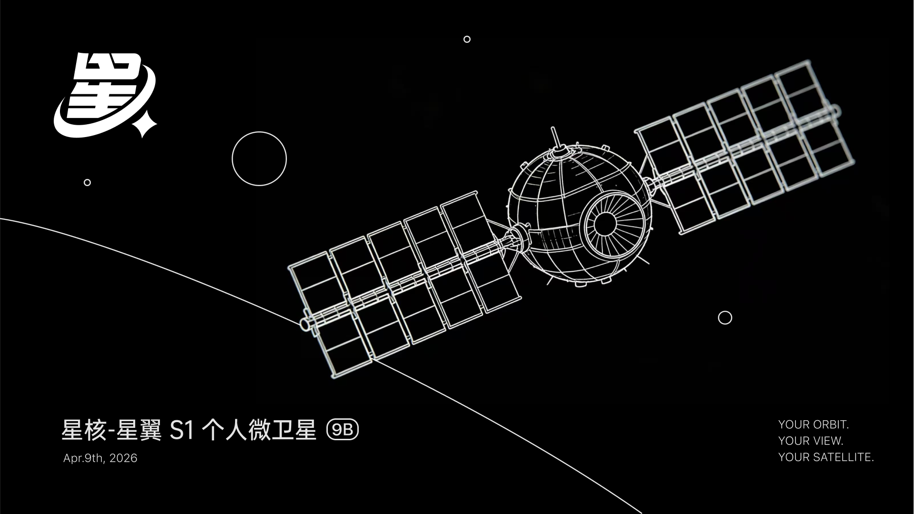
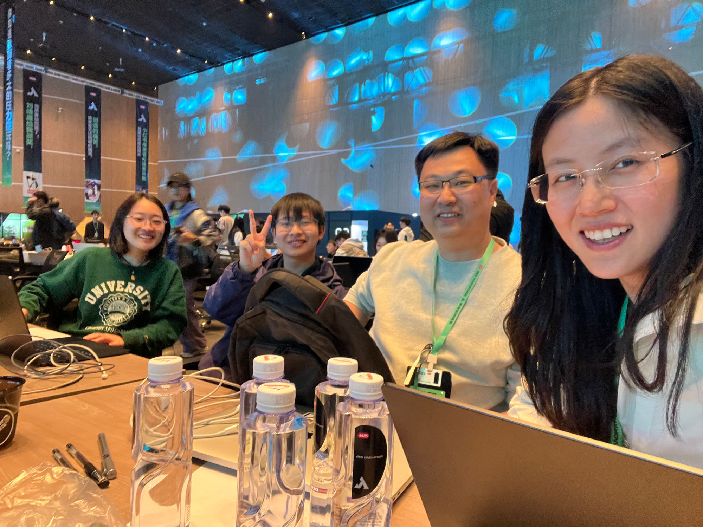
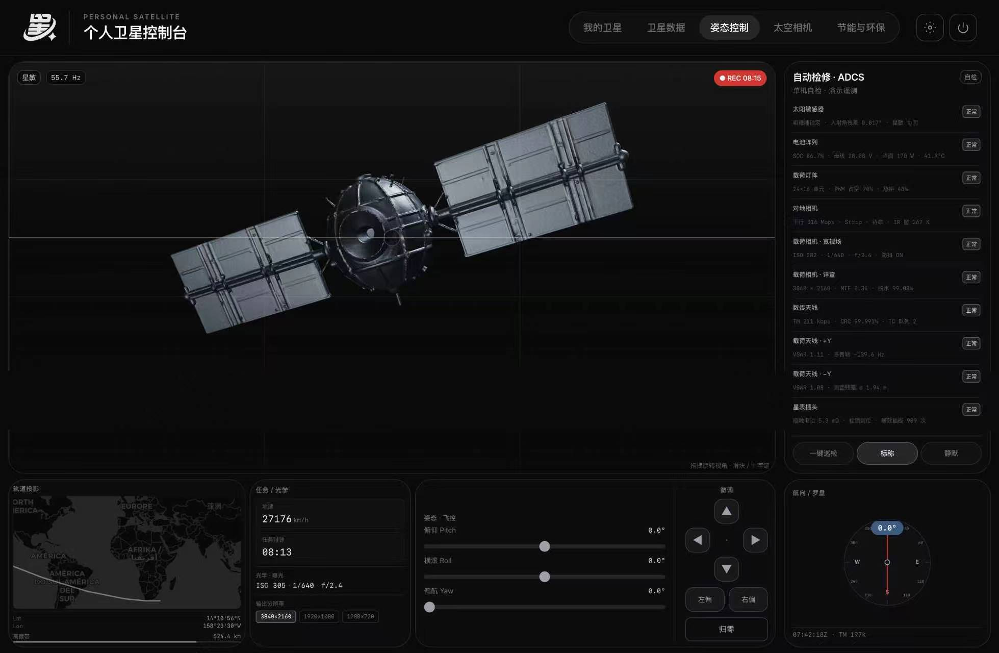
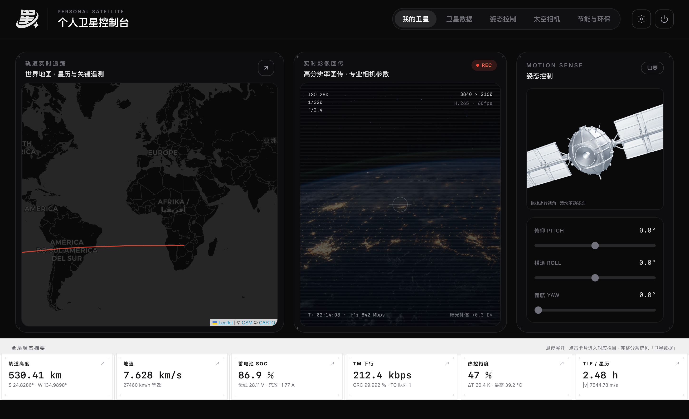
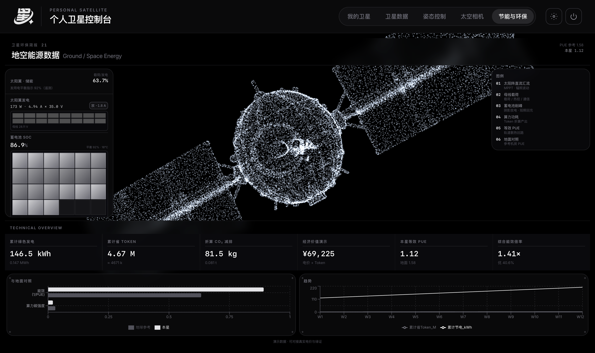
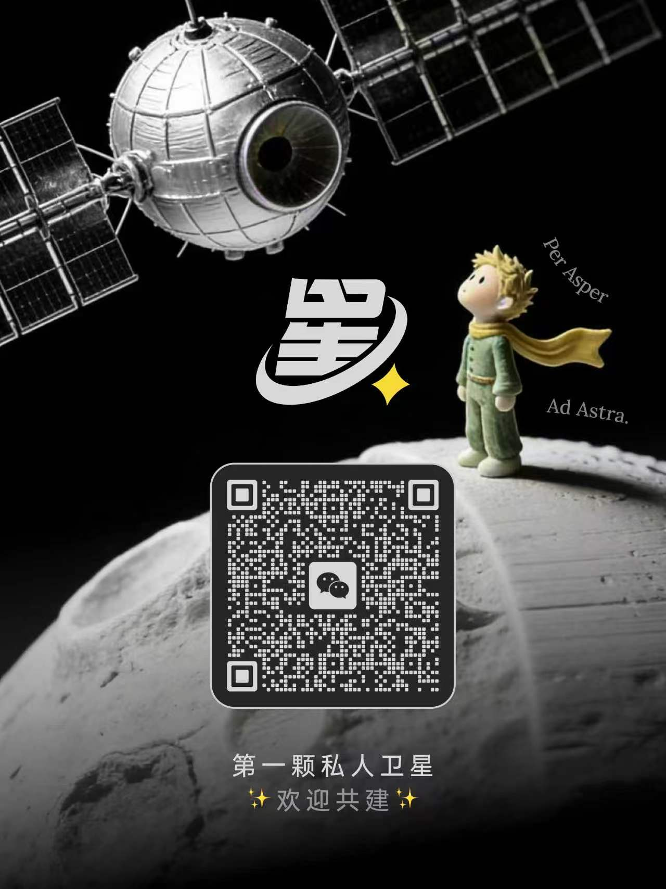

# "喂！星" -- 第一颗属于每个人的私人卫星

> YOUR ORBIT. YOUR VIEW. YOUR SATELLITE.



---

## 我们的题目

"喂！星"是一个关于"人人都能拥有一颗私人卫星"的交互式产品原型。用户拥有一颗运行在真实近地轨道上的虚拟私人卫星，可以用自然语言指挥它拍照、反射阳光、与 AI 对话，甚至用鸿蒙手机实时遥控它的姿态。

老实说，距离真正把一颗卫星送上天，我们连 1% 都还没做到。但我们相信这件事终有一天会实现，所以先从一个 Demo 开始。

### 术语与系统架构

"喂！星"项目由以下核心模块组成，各司其职：

```
"喂！星"（项目总称）
  |
  |-- 星核 Orb Core ........... 主控平台，负责总调度与管理
  |     |
  |     |-- 个人卫星控制台 ...... 面向用户的单颗卫星操控界面
  |     |                        （遥测、姿态、直播、轨迹）
  |     |
  |     |-- 卫星追踪 ........... 多星实时追踪与天空地图
  |     |
  |     |-- 第一视角 ........... 卫星沉浸式 POV 体验
  |     |
  |     +-- 地空能源系统 ....... 太阳能发电与算力积分管理
  |
  +-- 星翼 S1 ................. 个人微卫星本体
        （搭载边缘 AI、对地相机、反射镜阵列）
```

- **"喂！星"**：项目整体名称，涵盖从软件平台到卫星硬件的完整体系。
- **星核（Orb Core）**：Web 端主控平台，承担所有调度管理工作，是用户与卫星之间的中枢。用户通过星核下达任务、查看遥测、与 AI 对话。
- **星翼 S1**：个人微卫星的代号。运行在近地轨道上，搭载边缘 AI 算力、高分辨率对地相机和反射镜阵列，是"喂！星"在太空中的物理载体。
- **个人卫星控制台**：星核中面向单颗卫星的专业操控界面，提供实时遥测、姿态控制、卫星视角直播、地面轨迹投影四合一的工作台，用户在这里精确操控自己的星翼卫星。

### 数据来源

项目中的卫星轨道与空间态势数据来源于以下公开服务：

- [SpaceMapper](https://spacemapper.cn/help/helpinfo/1613) -- 卫星轨道数据与空间态势信息
- [SatHunt](https://sathunt.com/) -- 在轨卫星检索与追踪数据

部分展示场景中使用了 Mock 数据以辅助演示效果。

---

## 为什么我们有这个天马行空的想法

我们仰望星空两千年，今天第一次有机会在那里留下思想。

故事的起点很简单：如果光可以从天上照下来，世界会不会不一样？

太空算力、对地观测、太阳光反射这三件事，每一件都已经在现实中被验证过，但它们从来没有被整合在一起，也从来没有被交到普通人手里。我们想试试看，能不能用"自然语言 + 手机遥控"的方式，让普通人也能摸到太空的边。

我们大概率会失败，但万一呢。

### 现实依据

以下是已经发生的事实：

- **太空算力**：欧空局 OPS-SAT 已在国际空间站实测边缘 AI；SpaceX 已申请部署在轨数据中心；NVIDIA 于 2026 年 3 月发布 Space-1 芯片，太空算力商业化拐点已至。
- **太空相机**：Planet Labs 的 200+ 颗对地观测卫星每日扫描全球，已完全商业化。
- **太空反射阳光**：1993 年俄罗斯 Znamya 2 实验成功反射满月亮度的光到地面；Reflect Orbital 于 2026 年 4 月发射首颗商业反射测试卫星。
- **发射成本**：SpaceX Starship 的路线图将每公斤入轨成本从 $6500 压至 $67，个人卫星在经济上正在成为可能。

技术的拼图正在一块一块到位。至于什么时候能真正拼完，我们不知道，但觉得值得赌一把。

---

## 我们的团队

四个刚好的人，做一件刚好的事。

| 成员 | 背景 | 方向 |
|------|------|------|
| 邵瑞琪 | 清华 NLP，智源 · 基模 | AI 交互产品，从 0 到 1 主导 |
| 曹阳 | 北大直博，强化学习 | AI4S 方向，AISI 实习 |
| 朱利戈 | 全栈开发，开源作者 | 曾获李开复、雷军等知名投资人认可 |
| 王宇 | 科技博主 | AI Agent 方向，独立产品开发，科技内容创作者 |



48 小时，从一个想法到一个可以跑起来的双端联动 Demo。

---

## 可行性论证

### 技术可行性

"喂！星"的三大核心能力均有成熟的技术先例支撑：

| 能力 | 技术先例 | 当前状态 |
|------|----------|----------|
| 太空算力 | OPS-SAT 在轨 AI 实测、NVIDIA Space-1 芯片 | 商业化拐点 |
| 太空相机 | Planet Labs 200+ 颗卫星商业运营 | 完全商业化 |
| 太空反射阳光 | Znamya 2 实验验证、Reflect Orbital 商用测试 | 即将商用 |

### 经济可行性（设想）

如果有一天真的走到商业化，我们初步设想了三条可能的路径：

1. **个人订阅**：基础版免费体验虚拟卫星，Pro 版接入真实卫星数据与优先任务队列。
2. **企业/活动定制**：婚礼、演唱会、品牌活动的太空照明定制服务。
3. **开发者生态**：开放卫星 API，第三方应用通过 Energy Points 计费调用。

这些都还只是纸上谈兵，离落地很远，但方向上我们觉得说得通。

---

## 我们实现了哪些功能

### 硬件层

- 使用地瓜机器人制作粗版主控板
- 使用影石摄像头作为第一版摄影摄像装置
- 设计粗版卫星模型「豌豆射手」

### 软件层 -- Web 端（5 个场景全部完成）



**主控台**：核心交互页面。全屏三维地球、真实轨道上运行的卫星、开场动画、AI 对话窗口、实时遥测面板、任务照片查看器。

**卫星控制台**：2x2 专业工作台，集成实时遥测面板、可交互的 3D 姿态控制、卫星视角直播画面、地面轨迹投影，一次看懂一颗卫星的全部状态。



**卫星追踪**：面向普通人的"当前天空地图"，实时显示 20+ 颗真实在轨卫星，按类别配色（空间站 / GPS / Starlink / 气象 / 科研），点击任意一颗即可查看完整轨道与 90 分钟预测位置。

**第一视角**：站在卫星上向外看的沉浸视角，可在地球、月球、太阳、深空四个目标间自由切换，配备 HUD、扫描线、瞄准十字和实时姿态数据。

**地空能源系统**：可视化展示卫星太阳能发电与能源消耗的完整数据链路。



### 软件层 -- 鸿蒙端（已完成）

一个跑在 HarmonyOS 手机上的卫星遥控终端，让用户把手机当成真正的地面站使用。

- **一次扫码连接**：手机扫描 Web 端二维码，即刻与卫星配对
- **姿态遥控**：手机怎么转，卫星就怎么转。手机陀螺仪实时映射到卫星的 Pitch / Yaw / Roll
- **AR 卫星查看器**：通过手机摄像头把卫星 3D 模型"放"到桌面上，可以走近、绕到后面、从下面抬头看
- **3D 预览卡片**：手机上实时显示卫星当前姿态，与 Web 端完全同步
- **锁屏恢复**：锁屏/息屏回来，姿态与连接自动恢复

### 卫星经济系统

太阳能发电产生算力积分（Energy Points），执行任务时消耗。能量不用刻意补充，晒晒太阳就回来了。

---

## 未来规划

这次黑客松只是一个开头，后面的路还很长。

| 阶段 | 内容 |
|------|------|
| 第一阶段（当前） | 控制系统 + AI Agent 执行拍照任务，鸿蒙 APP 控制卫星姿态 |
| 第二阶段（造机） | 卫星壳体制造、成像设备集成、各类传感器阵列 |
| 第三阶段（上天） | 借助星舰技术降低发射成本，实现卫星折射太阳光等应用场景，众筹发射，人人参与 |

---

## 本地体验

**Web 端**

```bash
cd orb-core
npm install
npm run dev
```

打开 http://localhost:3000 进入主控台。支持局域网访问，鸿蒙手机可以通过同一局域网连入。

**鸿蒙端**

用 DevEco Studio 打开 `orbcore-app/`，连接 HarmonyOS 设备（或模拟器），一键运行安装。首次启动进入遥控连接页，扫码即可配对。

---

## 加入我们



Kickstarter 众筹发射计划即将启动，扫码加入社群，见证第一颗民间 AI 卫星的诞生。

---

## 参考文献

1. Liu, Y., et al. (2025). Space Computing: Architectures, Challenges, and Future Directions. *Intelligent Computing*, 4, Article 0134.
2. Zhang, X., et al. (2025). Computing over Space: Status, Challenges, and Opportunities. *Engineering*.
3. Wang, H., et al. (2025). Space-Based Computing Networks: Trends, Architecture, Challenges, and Key Technologies. *arXiv preprint*, arXiv:2503.06521.
4. NVIDIA Corporation. (2026, March 16). NVIDIA Launches Space Computing, Rocketing AI Into Orbit.
5. SpaceX. (2024). 2024 Starlink Progress Report.
6. Wang, B. (2025, January 20). SpaceX Starship Roadmap Lower Launch Costs by 100 Times. *NextBigFuture*.

---

## 致谢

感谢**小红书**作为主办方举办本次黑客松巅峰赛，没有这个舞台，四个素不相识的人不会聚在一起，也不会有这 48 小时的疯狂尝试。

感谢首席合作伙伴 **HarmonyOS** 提供的鸿蒙生态与技术支持，让我们的手机端地面站成为可能。感谢合作伙伴**地瓜机器人**为硬件主控板提供的支持，感谢**影石 Insta360** 为卫星摄像方案提供的设备与灵感。同时也感谢 ZhenFund、Snapmaker、EasyClaw、蓝盒子、慕华创投、真格基金、有新、FOUNDER PARK、极客公园、亚马逊云科技、Zeabur、基石基金、Shanghai AI Community、Monolith、AGI Bar、WaytoAGI、DT Transformer 以及联合主办方 GLV、ZK江、高瓴创投、上海人工智能实验室等所有合作伙伴和协办方的大力支持。

这次比赛中遇到了很多非常优秀的对手，看到了各种让人眼前一亮的作品，和这样一群人同场竞技本身就是一件很幸运的事。

也感谢每一位评委和志愿者的付出。

---

**参赛赛事**：黑客松巅峰赛 | **开源协议**：MIT License
